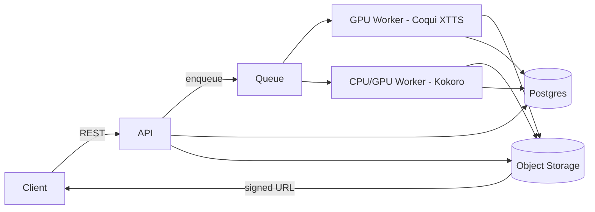
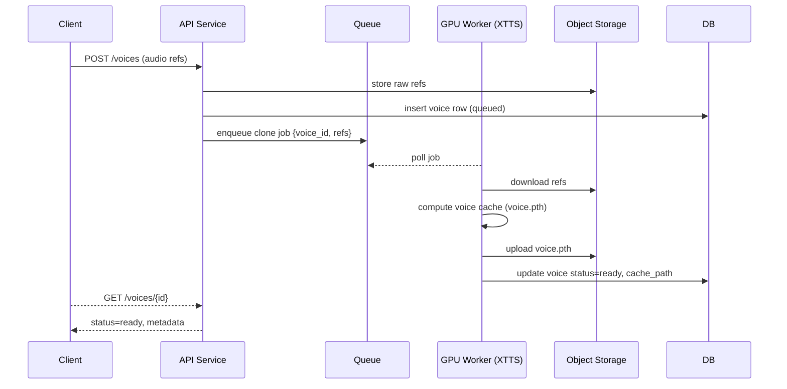
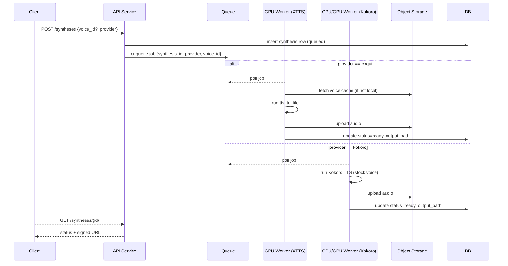

Voice cloning + TTS design (Coqui XTTS and Kokoro)
==================================================

What this covers
----------------
- Cloning: create/list voices using Coqui XTTS (caches voice embeddings).
- Synthesizing: TTS using cloned voices (Coqui) or stock voices (Kokoro).


REST API (v1)
-------------
- POST /voices  
  - Body: { name?, language, files: [wav/mp3], provider: "coqui" }  
  - Action: upload refs, enqueue clone job. Returns {voice_id, status="queued"}.
- GET /voices/{id}  
  - Returns metadata, status (queued|ready|failed), language, created_at.
- GET /voices  
  - List voices; filter by status/provider.
- DELETE /voices/{id}  
  - Mark deleted; GC removes artifacts later.
- POST /syntheses  
  - Body: { text, voice_id?, provider: "coqui"|"kokoro", language?, speed?, temperature?, top_p?, top_k?, length_penalty?, format? (wav|mp3) }  
  - If voice_id provided → Coqui cloned voice; if omitted/provider=kokoro → stock Kokoro voice. Returns {synthesis_id, status="queued"}.
- GET /syntheses/{id}  
  - Returns status (queued|processing|ready|failed), output_url (signed), params, durations.
- GET /health  
  - Liveness.
- Auth: API key/JWT + per-key rate limits.


Storage layout
--------------
- Object storage (e.g., S3/GCS):
  - voices/raw/{voice_id}/{uuid}.wav (uploads)
  - voices/cache/{voice_id}/voice.pth (Coqui XTTS cache)
  - outputs/{synthesis_id}.{wav|mp3}
  - kokoro/models/... (if self-hosting Kokoro weights)
- Postgres:
  - voices(id, name, provider, language, status, created_at, updated_at, metadata_json, raw_paths[], cache_path)
  - syntheses(id, voice_id nullable, provider, text_hash, params_json, output_path, status, created_at, completed_at, error)
  - api_keys(id, key_hash, owner, limits_json, created_at)


High-level architecture
-----------------------



Clone flow (Coqui XTTS)
-----------------------



Synthesis flow (Coqui cloned voice or Kokoro stock voice)
---------------------------------------------------------



Provider selection
------------------
- Coqui (cloned): requires `voice_id`; uses cached voice.pth; XTTS tuning knobs allowed (speed, temperature, top_p, top_k, length_penalty).
- Kokoro (non-cloned): ignore `voice_id`; use stock voices from Kokoro; expose Kokoro params (e.g., speaker preset, speed) in params_json.


Operational notes
-----------------
- Keep XTTS model warm on GPU workers; keep Kokoro weights on CPU/GPU workers.
- Validate uploads (length/type), transcode to WAV 16 kHz mono on ingest.
- Rate limit per API key; cap text length; async-only for long texts.
- Observability: metrics on queue depth, job latency, GPU util, synthesis duration, error rates.


Backend skeleton (FastAPI + SQLite + MinIO)
-------------------------------------------
Location: `backend/`
- Dependencies: see root `requirements.txt` (fastapi, uvicorn, sqlalchemy, pydantic, minio).
- Config: `backend/app/config.py` (env-driven via `.env` if desired).
- Database: SQLite at `backend/app/app.db` (auto-created).
- Object storage: MinIO/S3-compatible; defaults to localhost:9000 with bucket `mouthpiece`.
- API base: `/api`
  - Voices: POST /voices (optional file upload), GET /voices, GET /voices/{id}, DELETE /voices/{id}
  - Syntheses: POST /syntheses, GET /syntheses, GET /syntheses/{id}
  - Health: GET /health

Run locally (from repo root):
```bash
uv venv .venv && source .venv/bin/activate
uv pip install -r requirements.txt
export MINIO_ENDPOINT=localhost:9000 MINIO_ACCESS_KEY=minioadmin MINIO_SECRET_KEY=minioadmin MINIO_USE_SSL=false MINIO_BUCKET=mouthpiece
uvicorn backend.app.main:app --reload --port 8000 --app-dir backend
```
Ensure MinIO is running and the bucket is reachable; the app will create the bucket if missing.
